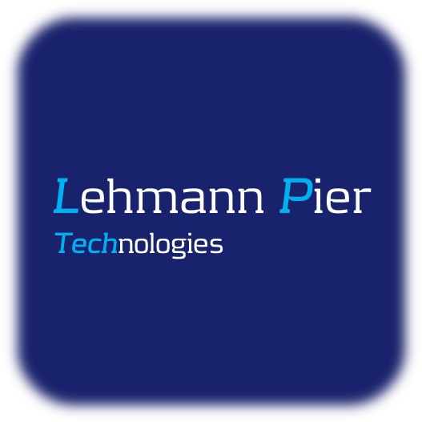

## [LP Tech - Streamlit Testlab](https://streamlit.pier.dk) 
My name is ***Anders Lehmann Pier***. I work as a **Cloud Architect / Solution Architect & DevOps engineer** at ***[IBM](https://ibm.com)***. You can check out my own **fully automated DevOps deployed Streamlit site**, at my own ***[Test Lab](https://streamlit.pier.dk)***.

I like to experiment with different technologies, such as **Automation, DevOps, Machine Learning, Generative AI, etc.** within the IT space.
This repo contains ***Anders Lehmann Pier's*** test applications, made with ***[Streamlit](https://streamlit.io/)***.  

***[Streamlit](https://streamlit.io/)*** is a free and open-source framework to rapidly build and share beautiful machine learning and data science web apps, but can also be used for rapid prototyping of regular web apps.

You are welcome to connect with me at: **[LinkedIn](https://www.linkedin.com/in/anderspier/)**.

Best regards,  
***Anders Lehmann Pier***.
